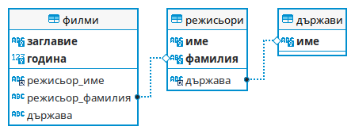

---

(2). Kакво ще изведе даденият по-долу фрагмент?

```
int a = 5;
switch(a) {
    case 7 - 2:
        System.out.println("match");
        break;
    default:
        System.out.println("no");
        break;
}
```

а) match <br>
б) no <br>
в) Кодът не е коректен, защото switch не може да получава аритметични изрази, а само числа. <br>
г) никое от изброените <br>

---

(4). Kакво ще изведе даденият по-долу фрагмент?

```
try {
    int[] arr = {};
    int a = arr[0];
    System.out.println("OK");
} catch (NullPointerException npe) {
    System.out.println("NullException");
} catch (IndexOutOfBoundsException iob) {
    System.out.println("Index out of bounds");
} catch (Exception e) {
    System.out.println("Exception");
}
```

а) OK <br>
б) Null pointer <br>
в) Index out of bounds <br>
г) Exception <br>

---

(5). Kакво ще изведе даденият по-долу фрагмент?

```
int a = 3, b = 7, c = 0;
a -= b;
c += b;
++c;
b /= c;
b--;
System.out.println(a + " " + b++ + " " + --c);
```

а) -4 -2 7 <br>
б) -4 -2 8 <br>
в) -4 -1 7 <br>
г) -4 0 8 <br>

---

(6). Кое от изброените е пример за отношение от тип 1:1 в релационна база от данни?

а) Работник - Мениджър <br>
б) Държава - Град <br>
в) Държава - Столица <br>
г) Родител - Дете <br>

---

(7). Коя последователност от команди и в какъв ред трябва да се изпълни, за да може да се запише информация в текстов файл?

  1. създаване на променлива от тип текстов файл със създадения текстов файл;
  2. затваряне на потока;
  3. отваряне на файла за четене;
  4. отваряне на файла за запис.

а) 1, 3, 4, 2  <br>
б) 1, 2, 3 <br>
в) 3, 4, 2 <br>
г) 1, 3, 2 <br>

---

(8). Kакво ще изведе даденият по-долу фрагмент?

```
List<Integer> nums = new ArrayList<>();
nums.add(2);
nums.add(5);
nums.add(2);
nums.add(3);
nums.add(2);
nums.add(2);
for (int i = 0; i < nums.size(); i++) {
    if (nums.get(i) == 2) {
        nums.remove(i);
    }
}
System.out.println(nums);
```

а) [3, 5]  <br>
б) [5, 3] <br>
в) [5, 3, 2] <br>
г) [5, 2, 3, 2, 2] <br>

---

(21). Kакво ще изведе даденият по-долу фрагмент?

```
switch (2) {
  case 1:
    System.out.println("one");
  case 2:
    System.out.println("two");
  case 3:
    System.out.println("three");
  default:
    System.out.println("another");
}
```

---

(22). Kакво ще изведе даденият по-долу фрагмент?

```
String a = new String("hello");
String b = new String("hello");
if (a == b) {
    System.out.println("same");
} else {
    System.out.println("another");
}
```

---

(23). Нека имаме следната база данни:




Какъв ще бъде резултатът от изпълнението на следната заявка?

```
SELECT режисьори.име, режисьори.фамилия
FROM режисьори LEFT JOIN филми ON режисьори.име = филми.режисьор_име
AND режисьори.фамилия = филми.режисьор_фамилия
WHERE филми.заглавие IS NULL
```

а) Русия<br>
б) Александър Веледински<br>
в) Форман Милош<br>
г) Опасен чар<br>

---

(24). Разгледайте дадения по-долу фрагмент. Три места в него са оставени празни.
Те са обозначени и номерирани с коментар, съдържащ число (например /* 1 */).
Какви конструкции трябва да се добавят на тяхно място, за да може кодът да реализира валидно възходящо сортиране на масив по метода на пряката селекция?

```
void selectionSort(int[] arr) {
  for (int i = 0; i < arr.length - 1; i++) {  
      int index = i;  
      for (int j = i + 1; j < arr.length; j++){  
          if (arr[j] < arr[/* 1 */]){  
              index = /* 2 */;
          }  
      }  
      int smallerNumber = /* 3 */;   
      arr[index] = arr[i];  
      arr[i] = smallerNumber;  
  }
}
```

---

(26). Създайте конзолен проект с име zad_26. Напишете class Animal, който да има
следните характеристики:
• name (име): знаков низ;
• age (възраст): цяло число.
Обектите на класа да са immutable (характеристиките им не могат да се променят
след конструирането на обекта). Класът да има конструктор, който задава
стойности на характеристиките.
Пренапишете метода toString - override, така че да връща низа:
<Име>, <възраст> years old


Дефинирайте клас RaceSnail, наследяващ Animal и съдържащ допълнителна характеристика:
• speed (скорост) : реално число.
Обектите на класа RaceSnail да са immutable (характеристиките им не могат да се
променят след конструирането на обекта). Класът да има конструктор, който
задава стойности на характеристиките. Пренапишете метода toString - override, така че да връща:
<Име>, <възраст> years old; <Скорост> m/s
Скоростта да бъде форматирана до втората цифра след десетичния разделител.


Напишете програма, която прочита от първия ред на стандартния вход цяло число
n - броя на охлювите.


Следващите редове ще съдържат информация за n охлюви. За всеки от тях първите три реда ще съдържат съответно името, възрастта и скоростта.


*Забележка:Входните данни ще бъдат коректни и не е необходимо да прихващате и обработвате
възможни изключения.


Пример:

<table>
  <tbody>
    <tr>
      <td>Вход</td>
      <td>Изход</td>
    <tr>
      <td>
        n=3<br>
        First name: John<br>
        Age: 2<br>
        Speed: 0.24<br>
        First name: Sarah<br>
        Age: 3<br>
        Speed: 0.2<br>
        First name: Mikel<br>
        Age: 1<br>
        Speed: 0.02<br>
      </td>
      <td>
        John, 2 years old; 0.24 m/s<br>
        Sarah, 3 years old; 0.20 m/s<br>
        Mikel, 1 years old; 0.02 m/s<br>
      </td>
    </tr>
  </tbody>
</table>