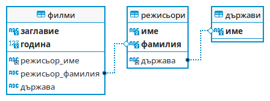
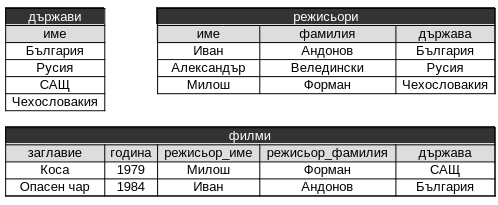

# Пробна матура по информатика, 3 май 2023

<style>
  .markdown-body .highlight pre, .markdown-body pre, .markdown-body .highlight {
    background-color: transparent;
  }
  .footer {
    display: none;
  }
</style>

(1). Какво ще се изпише в етикета message след изпълнение на програмния фрагмент?

```
float i = 15;
do --i;
while (i > -7);
message.setText(i.toString());
```

а) -6 <br>
б) -7 <br>
в) -8 <br>
г) 14 <br>

---

(2). Kакво ще изведе даденият по-долу фрагмент?

```
int a = 5;
switch(a) {
    case 7 - 2:
        System.out.println("match");
        break;
    default:
        System.out.println("no");
        break;
}
```

а) match <br>
б) no <br>
в) Кодът не е коректен, защото switch не може да получава аритметични изрази, а само числа. <br>
г) никое от изброените <br>

---

(3). Kакво ще изведе даденият по-долу фрагмент?

```
public class Shadow {
    static int a;
    public static void main(String[] args) {
        int a;
        a = 4;
        System.out.println(Shadow.a);
    }
}
```

а) 0 <br>
б) 4 <br>
в) RuntimeException <br>
г) друго <br>

---

(4). Kакво ще изведе даденият по-долу фрагмент?

```
try {
    int[] arr = {};
    int a = arr[0];
    System.out.println("OK");
} catch (NullPointerException npe) {
    System.out.println("NullException");
} catch (IndexOutOfBoundsException iob) {
    System.out.println("Index out of bounds");
} catch (Exception e) {
    System.out.println("Exception");
}
```

а) OK <br>
б) Null pointer <br>
в) Index out of bounds <br>
г) Exception <br>

---

(5). Kакво ще изведе даденият по-долу фрагмент?

```
int a = 3, b = 7, c = 0;
a -= b;
c += b;
++c;
b /= c;
b--;
System.out.println(a + " " + b++ + " " + --c);
```

а) -4 -2 7 <br>
б) -4 -2 8 <br>
в) -4 -1 7 <br>
г) -4 0 8 <br>

---

(6). Кое от изброените е пример за отношение от тип 1:1 в релационна база от данни?

а) Работник - Мениджър <br>
б) Държава - Град <br>
в) Държава - Столица <br>
г) Родител - Дете <br>

---

(7). Коя последователност от команди и в какъв ред трябва да се изпълни, за да може да се запише информация в текстов файл?

  1. създаване на променлива от тип текстов файл със създадения текстов файл;
  2. затваряне на потока;
  3. отваряне на файла за четене;
  4. отваряне на файла за запис.

а) 1, 3, 4, 2  <br>
б) 1, 2, 3 <br>
в) 3, 4, 2 <br>
г) 1, 4, 2 <br>

---

(8). Kакво ще изведе даденият по-долу фрагмент?

```
List<Integer> nums = new ArrayList<>();
nums.add(2);
nums.add(5);
nums.add(2);
nums.add(3);
nums.add(2);
nums.add(2);
for (int i = 0; i < nums.size(); i++) {
    if (nums.get(i) == 2) {
        nums.remove(i);
    }
}
System.out.println(nums);
```

а) [3, 5]  <br>
б) [5, 3] <br>
в) [5, 3, 2] <br>
г) [5, 2, 3, 2, 2] <br>

---

(9). Кое твърдение е вярно:

а) Функцията (методът) в Java има точно един оператор return;<br>
б) Функцията (методът) в Java има поне един оператор return;<br>
в) Функцията (методът) в Java връща най-много една стойност;<br>
г) Функцията (методът) в Java не връща стойност;<br>

---

(10). Кои са първите две операции, които ще се изпълнят при пресмятане стойността на израза?
```
A = 11.45 / 5 - 3.5 * ( 12.7 + 4.5 );
```
а) деление и събиране <br>
б) деление и умножение <br>
в) деление и действието в скобите <br>
г) умножение и действието в скобите <br>

---

(11). Три променливи са инициализирани по следния начин:
```
String a2="cat", a1="dog", a3="category";
```
Кой от следните изрази има стойност истина? <br>
а) a1.compareTo(a2) < 0 <br> 
б) a2.compareTo(a3) < 0 <br> 
в) a3.compareTo(a1) > 0 <br> 
г) a1.compareTo(a2) <=0 <br> 

---

(12). Кое твърдение не е вярно?


а) private_client е с дефиниция <b>protected </b> <br>
б) методът number е с дефинициия <b>public </b> <br>
в) number може да бъде наследяван <br>
г) dispatch може да бъде пренаписван (overload) от наследниците <br>

---

(13). Каква ще бъде стойността на променливата day след изпълнение на програмния фрагмент?
```
String [] array = {"понеделник", "вторник", "сряда", "четвъртък", "петък"};
String day = "понеделник";
for(int i=1; i < array.length; i++){
if(array[i] == "събота")
day = "неделя";
}
```
а) петък <br>
б) понеделник <br>
в) събота <br>
г) неделя <br>

---

(14). Запишете стойността, която ще бъде изписана на екрана след обръщението Func(21) ?
```
public static void Func (inr n) {
if (n<=0) {
  return ;
  }
Func (n/3);
System.out.print(n%3);
}
```

а) 202 <br>
б) 012 <br>
в) 210 <br>
г) 201 <br>

---

(15). В кой от програмните фрагменти тялото на цикъла ще се изпълни един път?

<table>
  <tbody>
    <tr> <b>
      <td> а)</td>
      <td> б) </td>
      <td> в) </td>
      <td> г) </td>
      </b> </tr>
    <tr>
      <td>int sum = 0; <br>
        int i = 1; <br>
        do { <br>
        sum + = i; <br>
        i++; <br>
        } while (i <= 3);
        </td>
      <td> int sum=0; <br>
      for (int i=1; i<=2; i+=2) <br>
             sum+=i;
      </td>
      <td>int sum = 0; <br>
        int i = 1; <br>
        while (i>=2){ <br>
        sum+=i; <br>
        i++; <br>
        }  <br>      
      </td>
      <td>int sum = 0; <br>
        int i = 1; <br>
        while (i<=2) { <br>
        sum+=i; <br>
        i++; <br>
        } <br>
      </td>
    </tr>
  </tbody>
</table>

---

(16). Кой от следните методи е <b>set</b> свойство на поле данни, декларирано като
```
private String lastName ;
```
a) private String setLastName (String name) { name = lastName; } <br>
б) private String setLastName (String name) { return name; } <br>
в) public void setLastName() { return lastName; }  <br>
г) public void setLastName (String name) { lastName=name; } <br>

---

(17). Подреди операторите в правилна последователност, така че след програмния фрагмент да получиш стойност beta=9.
Непосредствено преди тези редове са използвани декларациите:
```
int alpha=12/4;
int beta=Math.floor(-3.6);
int gamma=(12/5)++;
```
а)  else beta++; <br>
б)  else beta=Math.pow(beta, 2); <br>
в)  if (alpha>=beta) alpha++; <br>
г)  if (beta>=gamma) beta=Math.pow(gamma, 2); <br>
   

---

(18). При стартиране е въведена стойност за а=3. Допиши условието от последния ред, така че маркираният със стрелка оператор да се изпълни точно 9 пъти? <br>


---

(19). Попълни стойностите на елементите след изпълнение на програмния фрагмент.
```
string [] things={"pen", "pergel", "notebook", "tape"};
for (int i=1; i < 4; i++)
     things[i]=things[i-1]+"s";
```
things[0]= &nbsp;&nbsp;&nbsp;&nbsp;&nbsp;&nbsp;&nbsp;&nbsp;&nbsp;; <br>
things[1]= &nbsp;&nbsp;&nbsp;&nbsp;&nbsp;&nbsp;&nbsp;&nbsp;&nbsp;; <br>
things[2]= &nbsp;&nbsp;&nbsp;&nbsp;&nbsp;&nbsp;&nbsp;&nbsp;&nbsp;; <br>

---

(20). Какво стойности на <b>S</b> и на <b>Index</b> ще бъдат отпечатани след изпълнение на програмния код: <br>


---

(21). Kакво ще изведе даденият по-долу фрагмент?

```
switch (2) {
  case 1:
    System.out.println("one");
  case 2:
    System.out.println("two");
  case 3:
    System.out.println("three");
  default:
    System.out.println("another");
}
```

---

(22). Kакво ще изведе даденият по-долу фрагмент?

```
String a = new String("hello");
String b = new String("hello");
if (a == b) {
    System.out.println("same");
} else {
    System.out.println("another");
}
```

---

(23). Нека имаме следната база данни:





Какъв ще бъде резултатът от изпълнението на следната заявка?

```
SELECT режисьори.име, режисьори.фамилия
FROM режисьори LEFT JOIN филми ON режисьори.име = филми.режисьор_име
AND режисьори.фамилия = филми.режисьор_фамилия
WHERE филми.заглавие IS NULL
```

а) Русия<br>
б) Александър Веледински<br>
в) Форман Милош<br>
г) Опасен чар<br>

---

(24). Разгледайте дадения по-долу фрагмент. Три места в него са оставени празни.
Те са обозначени и номерирани с коментар, съдържащ число (например /* 1 */).
Какви конструкции трябва да се добавят на тяхно място, за да може кодът да реализира валидно възходящо сортиране на масив по метода на пряката селекция?

```
void selectionSort(int[] arr) {
  for (int i = 0; i < arr.length - 1; i++) {  
      int index = i;  
      for (int j = i + 1; j < arr.length; j++){  
          if (arr[j] < arr[/* 1 */]){  
              index = /* 2 */;
          }  
      }  
      int smallerNumber = /* 3 */;   
      arr[index] = arr[i];  
      arr[i] = smallerNumber;  
  }
}
```

---

[> Втора част](vtora-chast.html)