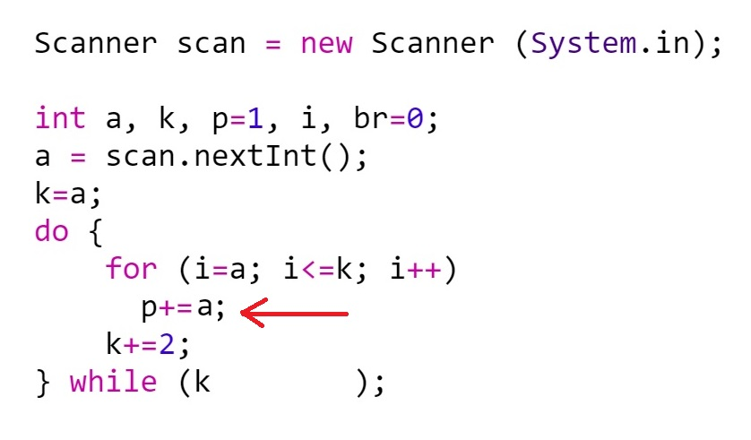

<style>
  .markdown-body .highlight pre, .markdown-body pre, .markdown-body .highlight {
    background-color: transparent;
  }
</style>

1. Какво ще се изпише в етикета message след изпълнение на програмния фрагмент?

```
float i = 15;
do --i;
while (i > -7);
message.setText(i.toString());
```

а) -6
б) -7
в) -8
г) 14


2. Kакво ще изведе даденият по-долу фрагмент?

```
switch (2) {
  case 1:
    System.out.println("one");
  case 2:
    System.out.println("two");
  case 3:
    System.out.println("three");
  default:
    System.out.println("another");
}
```

а) two
б) three
в) another
г) никое от изброените


3. Kакво ще изведе даденият по-долу фрагмент?
```
public class Shadow {
    static int a;
    public static void main(String[] args) {
        int a;
        a = 4;
        System.out.println(Shadow.a);
    }
}
```

а) 0
б) 4
в) RuntimeException
г) друго

// от тук са моите въпроси от 9 до 20

9. Кое твърдение е вярно:

а) Функцията (методът) в Java има точно един оператор return;<br>
б) Функцията (методът) в Java има поне един оператор return;<br>
в) Функцията (методът) в Java връща най-много една стойност;<br>
г) Функцията (методът) в Java не връща стойност;<br>


10. Кои са първите две операции, които ще се изпълнят при пресмятане стойността на израза?
```
A = 11.45 / 5 - 3.5 * ( 12.7 + 4.5 );
```
а) деление и събиране <br>
б) деление и умножение <br>
в) деление и действието в скобите <br>
г) умножение и действието в скобите <br>


11. Три променливи са инициализирани по следния начин:
```
String a2="cat", a1="dog", a3="category";
```
Кой от следните изрази има стойност истина? <br>
а) a1.compareTo(a2) < 0 <br> 
б) a2.compareTo(a3) < 0 <br> 
в) a3.compareTo(a1) > 0 <br> 
г) a1.compareTo(a2) <=0 <br> 


12. tralala


13. Каква ще бъде стойността на променливата day след изпълнение на програмния фрагмент?
```
String [] array = {"понеделник", "вторник", "сряда", "четвъртък", "петък"};
String day = "понеделник";
for(int i=1; i < array.length; i++){
if(array[i] == "събота")
day = "неделя";
}
```
а) петък <br>
б) понеделник <br>
в) събота <br>
г) неделя <br>


14. alabala


15. В кой от програмните фрагменти тялото на цикъла ще се изпълни един път?

<table>
  <tbody>
    <tr> <b>
      <td> а)</td>
      <td> б) </td>
      <td> в) </td>
      <td> г) </td>
      </b> </tr>
    <tr>
      <td>int sum = 0; <br>
        int i = 1; <br>
        do { <br>
        sum + = i; <br>
        i++; <br>
        } while (i <= 3);
        </td>
      <td> int sum=0; <br>
      for (int i=1; i<=2; i+=2) <br>
             sum+=i;
      </td>
      <td>int sum = 0; <br>
        int i = 1; <br>
        while (i>=2){ <br>
        sum+=i; <br>
        i++; <br>
        }  <br>      
      </td>
      <td>int sum = 0; <br>
        int i = 1; <br>
        while (i<=2) { <br>
        sum+=i; <br>
        i++; <br>
        } <br>
      </td>
    </tr>
  </tbody>
</table>

16. Кой от следните методи е <b>set</b> свойство на поле данни, декларирано като
```
private String lastName ;
```
a) private String setLastName (String name) { name = lastName; } <br>
б) private String setLastName (String name) { return name; } <br>
в) public void setLastName() { return lastName; }  <br>
г) public void setLastName (String name) { lastName=name; } <br>


---------------------------

17. Подреди операторите в правилна последователност, така че след програмния фрагмент да получиш стойност beta=9.
Непосредствено преди тези редове са използвани декларациите:
```
int alpha=12/4;
int beta=Math.floor(-3.6);
int gamma=(12/5)++;
```
а)  else beta++; <br>
б)  else beta=Math.pow(beta, 2); <br>
в)  if (alpha>=beta) alpha++; <br>
г)  if (beta>=gamma) beta=Math.pow(gamma, 2); <br>
   


18. При стартиране е въведена стойност за а=3. Допиши условието от последния ред, така че маркираният със стрелка оператор да се изпълни точно 9 пъти? <br>



// тук трябва да вмъкнеш картинката pic_1.jpg (качих я в директорията)


19. Попълни стойностите на елементите след изпълнение на програмния фрагмент.
```
string [] things={"pen", "pergel", "notebook", "tape"};
for (int i=1; i < 4; i++)
     things[i]=things[i-1]+"s";
```
things[0]= &nbsp;&nbsp;&nbsp;&nbsp;&nbsp;&nbsp;&nbsp;&nbsp;&nbsp;; <br>
things[1]= &nbsp;&nbsp;&nbsp;&nbsp;&nbsp;&nbsp;&nbsp;&nbsp;&nbsp;; <br>
things[2]= &nbsp;&nbsp;&nbsp;&nbsp;&nbsp;&nbsp;&nbsp;&nbsp;&nbsp;; <br>


20. Какво стойности на <b>S</b> и на <b>Index</b> ще бъдат отпечатани след изпълнение на програмния код: <br>
// тук трябва да сложиш pic_2.jpg (качила съм я в директорията на проекта)


--------------------------
25. Дадено е естествено число N (N <= 1000000000). Напишете програма, която разлага N на прости множители, по-големи от 1. Всеки от множителите изведете на отделен ред. Ако числото е просто, изведете NO. В програмата трябва да бъде направена необходимата валидация и прихващане на изключения.


<table>
  <tbody>
    <tr>
      <td><b>Примерен вход:</b></td>
      <td>20 </td>
      <td>330 </td>
      <td>13 </td>
    </tr>
    <tr>
      <td><b>Примерен изход:<br> &nbsp;<br>&nbsp;<br>&nbsp;<br> </b></td>
      <td>2 <br>  2 <br> 5 <br>&nbsp;</td>
      <td>2 <br>  3 <br> 5 <br> 11</td>
      <td>NO <br> &nbsp;<br>&nbsp;<br> &nbsp;<br></td>
    </tr>
  </tbody>
</table>


26. твой


27. твой


28. мой


