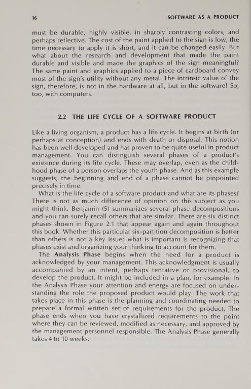
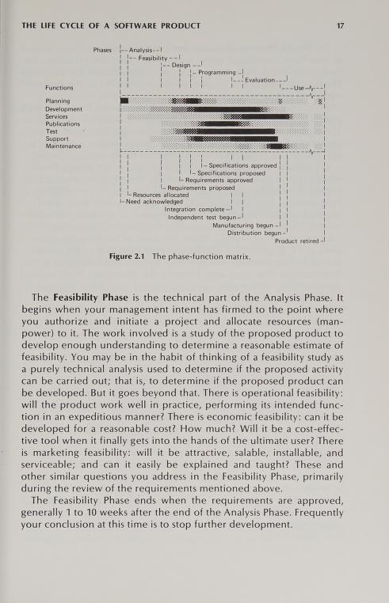
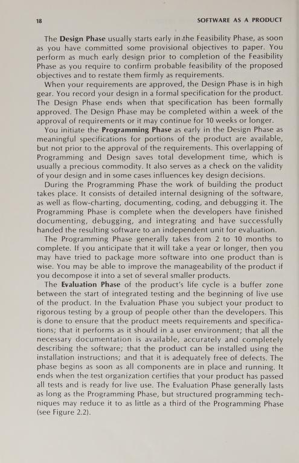
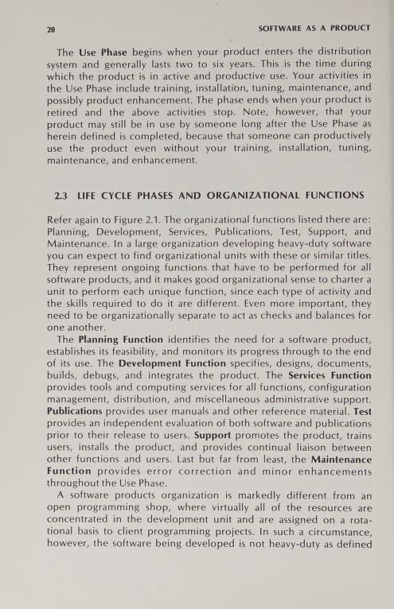
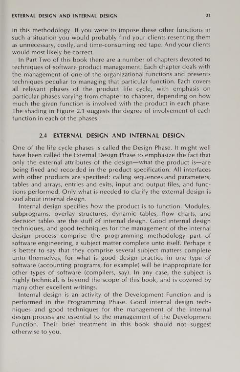

# Софтуерни технологии

Автори: Нели Манева и Аврам Ескенази

## Модел на Гънтър за жизнения цикъл на информационните системи

### Фази

1. Изследване
  - Начало:
  Това е началото на ЖЦ на ПП и е моментът на възникване на идеята за създаване на ПП.
  - Същност: През тази фаза се уточняват предназначението, основните функции и изисквания към разработвания ПП. Обикновено тази фаза включва маркетингово проучване на съществуващите в момента на софтуерния пазар аналогични ПП.
  - Резултат. След анализиране на съществуващи или описани в литературата аналогични ПП в края на фазата трябва да бъдат формулирани всички основни изисквания към ПП. Както и по-нататък, всеки подобен резултат се оформя в писмен документ. В случая той се нарича съглашение за изискванията (СИ).
  - Продължителност. 4—10 седмици.

2. Анализ на осъществимостта
  - Начало: Моментът на назначаване на ръководител на проекта.
  - Същност: През фазата изследване се установява какъв ПП трябва да бъде разработван. Въпросът е може ли това да се осъществи. Предназначението на тази фаза е да се установи може ли да се създаде ПП. Това става чрез анализ на:
    - Техническа осъществимост: анализ на достъпния хардуер както за осъществяване на разработката, така и за използване на готовия ПП. Освен вида на хардуера трябва да се анализират и необходимите за разработката други технически средства (инструментален софтуер, налични и изискуеми стандартизационни документи и np.).
    - Икономическа осъществимост: анализират се и се оценяват в рамките на възможното цената на разработване, цена, на която би се продавал ПП, и цената за експлоатация на ПП. Анализът на цената на разработване трябва да завършва с пълна яснота, как ще бъдат осигурявани необходимите средства, т. е. икономическата осъществимост показва и откъде ще се осигурят необходимите средства.
    - Експлоатационна осъществимост: анализират се преимуществата и недостатъците на замисления ПП от гледна точка на потребителите му, например: изисква ли се специална квалификация, какви технологични операции трябва да се извършват и дали са по силите на средния потребител, ще се реализират ли разумни стойност по отношение на бързината на обработките и т. н.
    - 	Пазарна осъществимост: на основата на маркетингово проучване се прави опит да се прогнозира дали новият ПП ще се търси, може ли да бъде конкурентоспособен и какви ще са силните му страни в сравнение с аналогичните ПП. Този анализ е важен за изграждането на маркетинговата стратегия на фирмата по отношение на ПП. Анализът на всички видове осъществимост се извършва от група специалисти със съответната квалификация.
  - Резултат: След евентуални промени се утвърждават формулираните в СИ изисквания.
   - Продължителност: 1—10 седмици след края на предишната фаза.
   
3. Проектиране
  - Начало: Съвпада с края на фазата изследване.
  - Същност: Целта е обхващането и отразяването на потребителския възглед за ПП. Това се нарича външен проект на предвидения ПП. Той представя ПП като черна кутия, към която се подават определени данни и се получават определени резултати. В детайли се обсъжда с потребителя и се проектира потребителският интерфейс. Разглеждат се и се уточняват връзките на ПП с операционната среда и други софтуерни средства, с които е свързано използването на ПП.
  - Резултат: Създаденият външен проект се оформя като документа "Външна спецификация".
  - Продължителност: 10 седмици.
  
4. Програмиране
  - Начало: Програмирането може да започне, когато външната спецификация е представена в някакъв вид, макар да не е преминала окончателно формално утвърждаване. Във всички случаи обаче СИ трябва да е било утвърдено.
  - Същност: През тази фаза се създава детайлен (вътрешен) проект. В него фактически е описано как ще се реализира ПП. Създава се с цялостната структурна схема на ПП. Вътрешният проект представя детайлно архитектурата на ПП с пълно описание на всяка програмна част, описание на потока на данните и потока на управлението. Детайлният проект трябва да се опише на такова ниво на подробност, че по това описание да могат да се напишат програмите на ПП. През тази фаза се извършва и така нареченото модулно тестване, т. е. всяка програмирана единица се тества самостоятелно. След завършване на модулното тестване всички създадени програмни части се интегрират в единна система, която по-нататък (но не в тази фаза) се тества като едно цяло (системно тестване)
  - Резултат: Получава се работоспособен ПП, който може да бъде представен за независимо тестване и последващи приемни изпитания.
  - Продължителност: Особено силно зависи от сложността и обема на ПП. По принцип обаче Гънтър смята, че не трябва да надвишава 10 месеца. Ако предварителните оценки показват по-голяма продължителност, то проектът трябва още в началото да се декомпозира на няколко отделни части с продължителност на фазата програмиране под 10 месеца.

5. Оценка
  - Начало: Това е моментът, в който ПП е сглобен от готовите програмни модули.
  - Същност: Целта е да се извърши така нареченото независимо тестване, т. е. създаденият ПП да се тества от специалисти, които не са участвали в разработването му. След това се провеждат приемни изпитания. Тяхната основна цел е да се провери съответствието между разработения ПП и СИ, съответствията между ПП и съставените за него спецификации; да се документира експлоатационната годност на ПП в реални потребителски условия; да се проверят качествата на документацията, включително нейната пълнота.
  - Резултат: Документ (протокол, сертификат), удостоверяващ експлоатационната годност на ПП, който позволява последващо предаване за разпространение и експлоатация.
   - Продължителност: Силно зависи от качеството на работа през предишните фази. Най-оптимистичната оценка е 1/3 от продължителността на фазата програмиране. Има случаи обаче, когато се достига продължителността на програмирането.

6. Използване
  - Начало: Това е моментът на издаване на документа за годност.
  - Същност: Тази фаза включва инсталирането и последващата експлоатация на ПП. Извършва се обучение на потребителите с различна продължителност в зависимост от квалификацията на потребителите и сложността на ПП. Всички видове съпровождане (усъвършенстване, отстраняване на грешки, добавяне на нови функции) също се извършват по време на тази фаза.
  - Резултат: Експлоатацията на ПП.
  - Продължителност: Определя се от конкретния ПП. Физическият край на 31 ПП настъпва, когато и последното копие на ПП се свали от употреба. Логически край на ПП — когато след достатъчно дълъг период на използване ПП е достигнал до такова състояние, че не са необходими никакви съпровождащи дейности от страна на разработчика за този ПП.
  
### Функции

Под функция се разбира съвкупност от сходни дейности, извършвани от група хора със съответната квалификация. Съгласно модела на Гънтър за всяка от седемте функции има отделна група от хора. Реално обаче това може да се осъществи само в големите софтуерни фирми.

1. Планиране
Тази функция обхваща дейностите по съставяне и проследяване на изпълнението на всички видове планове. В зависимост от обхвата си плановете се делят на:

-	такива, които се отнасят до организацията производител (фирмата) като
цяло:
  - целева програма,
  - стратегически план,
  - тактически план;
- свързани с всеки конкретен ПП:
  - бюджет,
  - план за работата на отделна група,
  - индивидуален план за всеки участник,
  - мрежов график,
  - Други.
  
Групата по планиране следва да се състои от хора с икономическо образование и с някаква специализация в областта на информатиката и на софтуерните технологии. Най-интензивно групата по планиране работи по време на фазите изследване и проектиране.

2. Разработване
Тази функция включва всички дейности, свързани с традиционните представи за програмирането. Групата по разработване проектира, следователно съставя външната и вътрешната спецификация, извършва програмирането и тестването (разбира се, без независимото), отстранява грешки, сглобява готовите модули, консултира съставящите съпровождащата документация. Тази група включва специалисти информатици и е основната.

3. Обслужване
Основната идея на Гънтър, въвеждайки тази фаза, е, че не е възможно и разумно на висококвалифицирани специалисти да се възлагат дейности от чисто технически характер. Дейностите по обслужването се разделят на следните групи:

  - административно-правни — свързани със съставянето на някои от документите:
    - договори,
    - мрежови графици,
    - финансови отчети,
    - данъчна документация.
    
Частта от групата, отговаряща за този тип дейности, включва и специалист с правно образование.
  
  - технически — състоят се в осигуряването на:
    - изчислителната техника и нейното поддържане,
    - заявените инструментални софтуерни средства,
    - стандарти и други нормативни документи.
    
  - изпитания от клас С — това са крайни изпитания, състоящи се в случаен избор сред готовите за разпращане комплекти от ПП и проверката им за качество и комплектност.

4. Документиране

Съответната на тази функция група отговаря за създаването и поддържането на потребителската документация. В нея се включват различните ръководства, инструкции, справочници, необходими на потребителя за правилното и ефективно експлоатиране на ПП. (Трябва да се прави разлика с вътрешната документация на разработчика, която се създава от други групи.)

Групата включва специалисти с филологическо образование, евентуално специалисти, които изготвят потребителската документация на чужд език (ако ще се разпространява в чужбина). В по-големите фирми тук се включва и специалист по софтуерни технологии. Задачата му е да проектира структурата на потребителската документация, да определи подходящи примери за илюстрирането й, след завършването й да провери съответствието с действието на ПП.

5. Изпитания

Тази функция обхваща дейностите по установяване на наличието на дефекти и на разлики между действителните свойства на ПП и спецификациите му. Разграничават се 3 вида изпитания:
  - Клас А — вътрешни, извършвани от самите разработчици при програмирането и сглобяването на ПП.
  - 	Клас В — независими, които се изпълняват от групата по изпитанията.
  - Клас С — случайни, описани по-горе и извършвани от групата по обслужването.

Тъй като групата по изпитания се занимава с откриване на дефекти, тя се състои от висококвалифицирани специалисти информатици.

6. Поддържане

Тази функция обхваща всички дейности, свързани с преките контакти на фирмата производител с потребителите:
  - проучване на потребителското мнение във фазата анализ на осъществи-
мостта;
  - защитаване интересите на потребителя още при избора на проектантски
или програмистки решения;
  - обучение на потребителя;
  - регламентиране и осъществяване на обратна връзка с потребителя на даден ПП: получаване и систематизиране на съобщенията за грешки и на заявките за изменения по искане от страна на потребителите;
  - връзки с обществеността.

7. Съпровождане
Обхваща всички дейности по внасяне на промени в готовия ПП:
  - поправяне на грешки;
  - добавяне на нови възможности;
  - адаптиране на ПП към нова операционна или хардуерна среда.

Извършва се от разработчиците. Изисква най-високата възможна квалификация, защото, както е известно, в повечето случаи внасянето на коректни изменения в съществуваща програма е по-трудно, отколкото създаването на нова програма.

Съпровождането може да се извършва на различни равнища:
  - гаранционно съпровождане — обикновено то включва задължения за безусловно и безвъзмездно отстраняване на грешки по искане на потребителя, като по българските стандарти има срок 12 месеца;
  - развитие на ПП и отстраняване на грешки;
  - отстраняване на грешки;
  - регистриране на съобщенията за грешки и на заявките за подобряване с оглед вземането им под внимание при евентуално разработване на нов подобен ПП. Режимът на съпровождане може да зависи от конкретно подписания договор, ако има пряка връзка между разработчика и потребителя.
  

