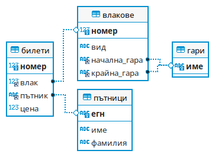
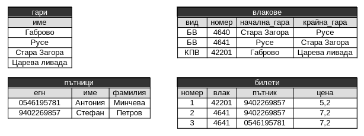

# Пробна матура по информатика, 3 май 2023

<style>
  .markdown-body .highlight pre, .markdown-body pre, .markdown-body .highlight {
    background-color: transparent;
  }
  .footer {
    display: none;
  }
</style>

(25).Дадено е естествено число N (N <= 1000000000). Напишете програма с име zad_25, която разлага N на прости множители, различни от 1 и от N. Всеки от множителите изведете на отделен ред. Ако числото е просто, изведете NO. В програмата трябва да бъде направена необходимата валидация и прихващане на изключения.


<table>
  <tbody>
    <tr>
      <td><b>Примерен вход:</b></td>
      <td>20 </td>
      <td>330 </td>
      <td>13 </td>
    </tr>
    <tr>
      <td><b>Примерен изход:<br> &nbsp;<br>&nbsp;<br>&nbsp;<br> </b></td>
      <td>2 <br>  2 <br> 5 <br>&nbsp;</td>
      <td>2 <br>  3 <br> 5 <br> 11</td>
      <td>NO <br> &nbsp;<br>&nbsp;<br> &nbsp;<br></td>
    </tr>
  </tbody>
</table>

---

(26). Създайте конзолен проект с име zad_26. Напишете class Animal, който да има
следните характеристики:
• name (име): знаков низ;
• age (възраст): цяло число.
Обектите на класа да са immutable (характеристиките им не могат да се променят
след конструирането на обекта). Класът да има конструктор, който задава
стойности на характеристиките.
Пренапишете метода toString - override, така че да връща низа:

```
<Име>, <възраст> years old
```

Дефинирайте клас RaceSnail, наследяващ Animal и съдържащ допълнителна характеристика:
• speed (скорост) : реално число.
Обектите на класа RaceSnail да са immutable (характеристиките им не могат да се
променят след конструирането на обекта). Класът да има конструктор, който
задава стойности на характеристиките. Пренапишете метода toString - override, така че да връща:

```
<Име>, <възраст> years old; <Скорост> m/s
```

Скоростта да бъде форматирана до втората цифра след десетичния разделител.
<br>

Напишете програма, която прочита от първия ред на стандартния вход цяло число
n - броя на охлювите.
<br>

Следващите редове ще съдържат информация за n охлюви. За всеки от тях първите три реда ще съдържат съответно името, възрастта и скоростта.

<br><br>

*Забележка:Входните данни ще бъдат коректни и не е необходимо да прихващате и обработвате
възможни изключения.
<br>

Пример:

<table>
  <tbody>
    <tr>
      <td>Вход</td>
      <td>Изход</td>
    <tr>
      <td>
        n=3<br>
        First name: John<br>
        Age: 2<br>
        Speed: 0.24<br>
        First name: Sarah<br>
        Age: 3<br>
        Speed: 0.2<br>
        First name: Mikel<br>
        Age: 1<br>
        Speed: 0.02<br>
      </td>
      <td>
        John, 2 years old; 0.24 m/s<br>
        Sarah, 3 years old; 0.20 m/s<br>
        Mikel, 1 years old; 0.02 m/s<br>
      </td>
    </tr>
  </tbody>
</table>

---

(27). Създайте база от данни с име „бдж“

a) Проектирайте я по диаграмата:



б) Попълнете я с данните:



в) Напишете заявки за извеждането на:
  - всички данни от таблицата с влаковете;
  - гарите, чиито имена са по-дълги от 8 знака;
  - следната информация за всеки продаден билет: име на пътника, фамилия, начална гара на влака, крайна гара, цена на билета

---

(28). мой


